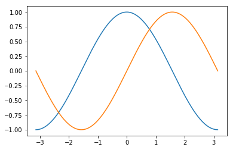

# Jupyter 연습
## 1.Jupyter NoteBook은 무엇인가

주피터 노트북은 오픈소스 웹어플리케이션이며 문서, 비디오 공식도 사용가능하게 만든다

## 2. 코드연습


```python
3+4
```


    7


```python
def add(a,b):
    return a+b;

add(2,3)
```


    5


```python
add(45,54)
```


    99


## 3.Equation
## 4. 시각화

## 3.Equation
## 4. 시각화
### 4.1 이미지


```python
from IPython.display import Image
Image( url="http://newsimg.sedaily.com/2017/06/26/1OHCLP8HKJ_1.jpg",width=400,height=400)
```


### 4.2 비디오


```python
from IPython.display import YouTubeVideo
YouTubeVideo("x66_dBnZ7NE")

```


        <iframe
            width="400"
            height="300"
            src="https://www.youtube.com/embed/x66_dBnZ7NE"
            frameborder="0"
            allowfullscreen
        ></iframe>
        


### 4.3 테이블


```python
import pandas as pd
url="https://raw.githubusercontent.com/cs109/2014_data/master/countries.csv"
pd.read_csv(url,nrows=10)
```


<div>
<style>
    .dataframe thead tr:only-child th {
        text-align: right;
    }

    .dataframe thead th {
        text-align: left;
    }

    .dataframe tbody tr th {
        vertical-align: top;
    }
</style>
<table border="1" class="dataframe">
  <thead>
    <tr style="text-align: right;">
      <th></th>
      <th>Country</th>
      <th>Region</th>
    </tr>
  </thead>
  <tbody>
    <tr>
      <th>0</th>
      <td>Algeria</td>
      <td>AFRICA</td>
    </tr>
    <tr>
      <th>1</th>
      <td>Angola</td>
      <td>AFRICA</td>
    </tr>
    <tr>
      <th>2</th>
      <td>Benin</td>
      <td>AFRICA</td>
    </tr>
    <tr>
      <th>3</th>
      <td>Botswana</td>
      <td>AFRICA</td>
    </tr>
    <tr>
      <th>4</th>
      <td>Burkina</td>
      <td>AFRICA</td>
    </tr>
    <tr>
      <th>5</th>
      <td>Burundi</td>
      <td>AFRICA</td>
    </tr>
    <tr>
      <th>6</th>
      <td>Cameroon</td>
      <td>AFRICA</td>
    </tr>
    <tr>
      <th>7</th>
      <td>Cape Verde</td>
      <td>AFRICA</td>
    </tr>
    <tr>
      <th>8</th>
      <td>Central African Republic</td>
      <td>AFRICA</td>
    </tr>
    <tr>
      <th>9</th>
      <td>Chad</td>
      <td>AFRICA</td>
    </tr>
  </tbody>
</table>
</div>


### 4.4 Chart


```python
import numpy as np
import matplotlib.pyplot as plt
%matplotlib inline

X = np.linspace(-np.pi, np.pi, 256,endpoint=True)
C,S = np.cos(X), np.sin(X)

plt.plot(X,C)
plt.plot(X,S)
```


    [<matplotlib.lines.Line2D at 0x16ee81c22b0>]





### 5.Performance 


```python
%timeit 3^4
```

    10.7 ns ± 0.0203 ns per loop (mean ± std. dev. of 7 runs, 100000000 loops each)
    


```python
%timeit 3*3*3*3
```

    10.7 ns ± 0.00979 ns per loop (mean ± std. dev. of 7 runs, 100000000 loops each)
    
